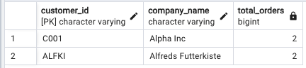

# SQL_Northwind_Analysis
This project showcases advanced SQL analytics using a simulated Northwind-style sales dataset in PostgreSQL with pgAdmin 4.

# SQL Analytics with PostgreSQL: Northwind Challenge

## Project Overview
This project showcases advanced SQL analytics using a simulated Northwind-style sales dataset in PostgreSQL with **pgAdmin 4**. It's designed to demonstrate proficiency in:
- SQL Joins, Aggregates, Grouping
- Window Functions (RANK, LAG)
- Common Table Expressions (CTEs)
- Business-focused insights from relational data

## Tools & Stack
- **Database**: PostgreSQL (via pgAdmin 4)
- **Schema**: Customers, Orders, Order_Details, Products
- **Dataset**: Simulated data in CSV format with referential integrity

## Schema Structure
- **customers** (`customer_id`, `company_name`, `contact_name`, `country`)
- **orders** (`order_id`, `customer_id`, `order_date`, `ship_country`)
- **products** (`product_id`, `product_name`, `unit_price`)
- **order_details** (`order_id`, `product_id`, `quantity`, `unit_price`, `discount`)

> Note: Dataset is simulated based on the Northwind schema for relational querying and analytics. Can be replaced by full Northwind or sales data for scale.

## Analytical SQL Queries & Insights

### Top 5 Customers by Lifetime Order Value
```sql
-- Shows most valuable customers
```


### Monthly Sales Trend + Running Total (Window Function)
```sql
-- Tracks growth using DATE_TRUNC + SUM + OVER()
```


### Top Selling Products by Quantity
```sql
-- Product popularity (total units sold)
```


### Customer Order Frequency (Repeat Engagement)
```sql
-- Orders per customer
```


### Average Order Value by Country
```sql
-- Regional purchasing power comparison
```


### Rank Top Products by Revenue (Window + RANK)
```sql
-- Revenue contribution & ranking
```


### Customer Reorder Rate (Repeat Buyers)
```sql
-- Filters customers with >1 order
```


### Monthly Growth Rate Using CTE + LAG()
```sql
-- Sequential % growth month-over-month
```


## How to Run Locally
1. Clone the repo
2. Open pgAdmin 4 and create a new database
3. Run `northwind_postgres.sql` to create tables
4. Load each `.csv` into its respective table
5. Open and execute `queries_analysis.sql`

## What This Project Demonstrates
- Ability to model relational data for insights
- Proficiency in advanced SQL: joins, window functions, CTEs
- Strong understanding of business metrics (revenue, customer value, repeat orders)
- Clean visual evidence of SQL output

## Repo Structure
```
SQL_Northwind_Analysis/
├── Data/
│   ├── customers.csv
│   ├── orders.csv
│   ├── products.csv
│   └── order_details.csv
├── Images/
│   └── [query1_query8 screenshots].png
├── northwind_postgres.sql  # Schema definition
├── queries_analysis.sql    # All SQL queries
└── README.md
```

## Credits
Project by **Junghyun Cheon** | Entry-Level Data Analyst & AI/ML Enthusiast  
Structured for job-seeking purposes, targeting U.S. roles

---